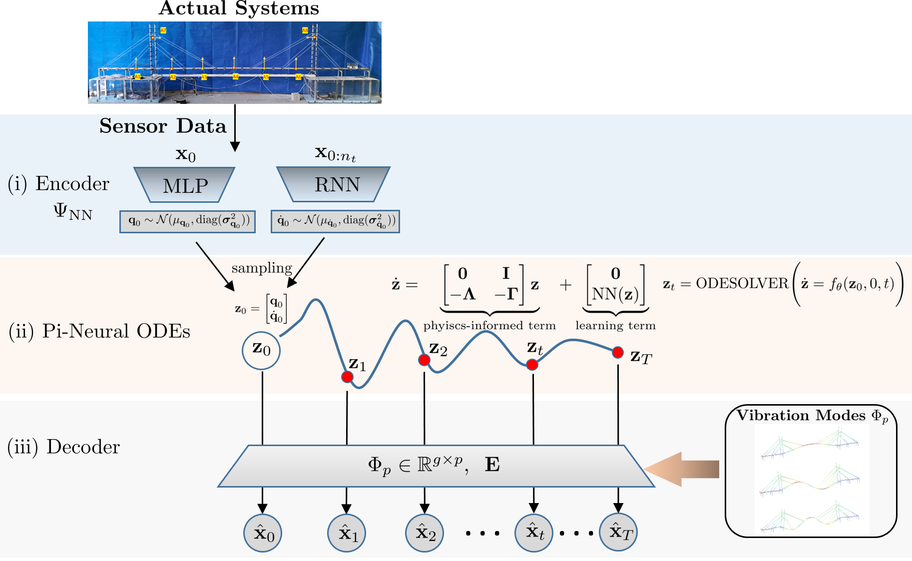

# Neural Modal ODEs

This repository contains a PyTorch impelementation of a demonstrative example in the following paper:

* "Integrating Physics-based Modeling with Neural ODEs for Modeling High Dimensional Monitored Structures."
Zhilu Lai, Wei Liu, Xudong Jian, Kiran Bacsa, Limin Sun, and Eleni Chatzi (2022). 

## Framework

The architecture of Neural Modal ODEs is comprised of:

* an encoder $\Psi_{\text{NN}}$: performing inference from a handful observational data to the initial conditions of latent quantities $\textbf{z}_0$
* Physics-informed Neural ODEs (Pi-Neural ODEs): modeling the dynamics of latent quantities structured by (a modal representation + a learning term) 
* a decoder $\Phi_p$: emitting the latent quantities to the full-field observational space, enforced by the eigenmodes derived from eigen-analysis of the structural matrices of the (or linearized) physics-based models

## Results

In this 4-DOF linear/nonlinear Structural Dynamical System, we only measure $\ddot{x}_1$, $\ddot{x}_3$, $\ddot{x}_4$, and $x_4$: 

* The full-field responses are successfully reconstructed via Neural Modal ODEs. 

* "FEM" in the figure, means the purely physics-based models, where we intentionally introduce model noise into the model. We integrate this "inaccurate" model with observational data via Neural Model ODEs, forming a hybrid model -- the discrepancy term $\text{NN}(\textbf{z})$ is capbale of rectifying the model inaccuracy.    

     

## Repository Overview
* `Neural_Modal_ODE_demo.py` - main function, managing model training and testing.
* `data_generation.py` - function for generating data set from a simulated 4-DOF nonlinear system.
* `models.py` - PyTorch modules for the encoder.

* `data` - generated data set from a simulated dynamical system. 
* `modal_para.npz` - modal parameters of the simulated system.
* `measured_data_nonlinear.npz` - generated observational data.
 

